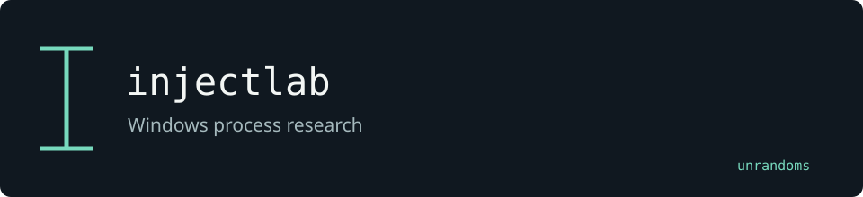

# injectlab

A collection of Windows process-injection examples with additional experiments maintained in this fork.

Maintained by [unrandoms](https://github.com/unrandoms), derived from [Offensive-Panda/ProcessInjectionTechniques](https://github.com/Offensive-Panda/ProcessInjectionTechniques).

## Fork-specific work

No isolated addition is documented here as a validated feature; inspect the branch history before relying on the experiments.

## Validation and limits

Windows-specific examples require an isolated Windows build and test environment. They are not validated by the Linux review.

This documentation update does not certify all inherited features. The [archived reference](UPSTREAM_README.md) describes the original ecosystem; its package names and release links may target upstream rather than this fork.

## Credits

See [CREDITS.md](CREDITS.md) for the distinction between the original implementation and this fork's adaptations. Original licenses and copyright notices remain in the repository.
